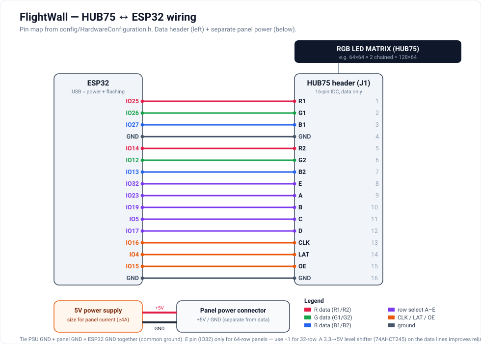

# TheFlightWall

TheFlightWall is an LED wall which shows live information of flights going by your window.

This open-source build is at **feature parity with the [FlightWall Mini](https://theflightwall.com/products/flightwall-mini-flight-tracking-led-display)**: configure and control everything from a built-in **web page** (no app required), with two tracking modes, live flight metrics, filters, and a day/night brightness schedule. See [Configuration & Control](#configuration--control-web-ui).

This is the open source version with some basic guides to the panels, mounting them together, data services, and code. Check out our viral build video: [https://www.instagram.com/p/DLIbAtbJxPl](https://www.instagram.com/p/DLIbAtbJxPl)

**Don't feel like building one? Check out the offical product: [theflightwall.com](https://theflightwall.com)**


*Now with bundled airline logo tiles and a Mini-style flight card — see [Airline logos](#airline-logos).*

# Component List
- Main components
    - 20x [16x16 LED panels](https://www.aliexpress.us/item/2255800358269772.html)
    - ESP32 dev board (we used the [R32 D1](https://www.amazon.com/HiLetgo-ESP-32-Development-Bluetooth-Arduino/dp/B07WFZCBH8) but any ESP dev board should work)
    - 3D printed brackets (or MDF / cardboard)
    - 2x 6ft wooden trim pieces (for support)
- Power
    - [5V >20A power supply](https://www.amazon.com/dp/B07KC55TJF) (for 20 panels)
    - [3.3V - 5V voltage level shifter](https://www.amazon.com/dp/B07F7W91LC)
- Data
    - [OpenSky](https://opensky-network.org/) for ADS-B flight data
    - [FlightAware AeroAPI](https://www.flightaware.com/commercial/aeroapi/) for route, aircraft, and airline information

# Hardware

## Dimensions

With 20 panels (10x2) - ~63 inches x ~12.6 inches

## LED Panels
[These are the LED panels we used](https://www.aliexpress.us/item/2255800358269772.html), but any similar LED matrix should work.

We designed 3D printable brackets to attach the panels together, this is one approach, but you could also use MDF board or even cardboard (as we did originally haha)

Then two 63 inch horizontal supports for extra strength. We bought wooden floor trim and cut it to size.


Obviously this is just one way to hold them together, but we're sure there are better ways!

## Display: HUB75 RGB matrix

This firmware drives a **HUB75 RGB LED matrix** (like the 128×64 used by the FlightWall Mini), via the [ESP32-HUB75-MatrixPanel-DMA](https://github.com/mrcodetastic/ESP32-HUB75-MatrixPanel-DMA) library. Default geometry is a 64×64 panel ×2 chained = **128×64**; set your panel width/height and chain length from the web UI.

### HUB75 → ESP32 pin map
The data pins are the only compile-time hardware setting — edit them in [`firmware/config/HardwareConfiguration.h`](firmware/config/HardwareConfiguration.h) to match your wiring:

| HUB75 | GPIO | HUB75 | GPIO | HUB75 | GPIO |
|---|---|---|---|---|---|
| R1 | 25 | R2 | 14 | A | 23 |
| G1 | 26 | G2 | 12 | B | 19 |
| B1 | 27 | B2 | 13 | C | 5 |
| CLK | 16 | LAT | 4 | D | 17 |
| OE | 15 | | | E | 32 |

`E` is only needed for 1/32-scan (64-row) panels; set it to `-1` for 32-row panels. Power the panel from the external **5V** supply with grounds tied to the ESP32.



> The legacy WS2812B single-data-line wiring diagram (no longer used by this firmware) is kept at [`images/wiring-diagram.png`](images/wiring-diagram.png) for reference.

# Data and Software

## Data API Keys

The data for this project consists of two parts:
1. **Flight positions & callsigns** — public [ADS-B](https://en.wikipedia.org/wiki/Automatic_Dependent_Surveillance%E2%80%93Broadcast) data via [OpenSky](https://opensky-network.org) (free, needs an OAuth client id/secret).
2. **Flight enrichment** — airline, route (origin/destination), and aircraft type. Selectable in the web UI:
   - **[adsbdb.com](https://www.adsbdb.com/)** — *default, free, no API key.* Callsign → route + airline, ICAO24 → aircraft type.
   - **[FlightAware AeroAPI](https://flightaware.com/aeroapi)** — paid; optional. Can be the primary source, or just a **backup** that only fires when adsbdb misses a flight (so you pay only for the gaps).
   - **Off** — show callsign only.

Enrichment results are **cached per aircraft** (default 10 min) so loitering planes aren't re-queried every cycle. Out of the box the wall costs **$0** for enrichment — you only need the OpenSky credentials. Enter everything later in the web UI — you do **not** have to hardcode anything.

### Setting up OpenSky
1. Register for an [OpenSky](https://opensky-network.org/) account
2. Go to your [account page](https://opensky-network.org/my-opensky/account)
3. Create a new API client and note the `client_id` and `client_secret`

### Setting up AeroAPI
1. Go to the [FlightAware AeroAPI](https://flightaware.com/aeroapi) page and create a personal account
2. From the dashboard, open **API Keys**, click **Create API Key** and follow the steps
3. Copy the generated key

## Software Setup

### Build and flash with PlatformIO

The firmware can be built and uploaded to the ESP32 using [PlatformIO](https://platformio.org/).

1. **Install PlatformIO**:
   - Install [VS Code](https://code.visualstudio.com/)
   - Add the [PlatformIO IDE extension](https://platformio.org/install/ide?install=vscode)

2. **(Optional) Bake in your WiFi at flash time** — instead of using the browser setup AP, copy [`firmware/config/Secrets.h.example`](firmware/config/Secrets.h.example) to `firmware/config/Secrets.h` and fill in your WiFi (and optionally API) credentials:
   ```cpp
   #define FW_WIFI_SSID      "YourWiFiName"
   #define FW_WIFI_PASSWORD  "YourWiFiPassword"
   ```
   `Secrets.h` is **gitignored**, so your password is never committed. These values seed the device on first boot; afterwards everything is managed from the web UI. (The data pin in [HardwareConfiguration.h](firmware/config/HardwareConfiguration.h) is the only other compile-time setting.)

3. **Upload the firmware and the web UI** (two artifacts). From the `firmware` folder:
   ```bash
   pio run --target upload      # flash the firmware
   pio run --target uploadfs    # flash the web UI (LittleFS image in firmware/data/)
   ```
   In the PlatformIO IDE these are **Upload** and **Upload Filesystem Image** under the project tasks. Run `uploadfs` once (and again whenever `firmware/data/index.html` changes).

## Configuration & Control (Web UI)

There is no app to install — the device hosts its own configuration page.

### First-time setup (WiFi provisioning)
On first boot (no WiFi saved yet) the wall starts a setup access point named **`FlightWall-Setup`**. Connect your phone/laptop to it and a captive-portal config page opens automatically (or browse to `http://192.168.4.1`). Enter your WiFi + API keys, save, and restart. After that the wall joins your network — the display shows its IP on boot, and you can reach the same page at **`http://flightwall.local/`** (mDNS) or `http://<that-ip>/`.

### Set credentials over USB serial (no recompile)
After flashing, you can also configure the device from the serial monitor — handy for setting WiFi without the setup AP or editing files:
```bash
pio device monitor -b 115200
```
Then type commands (`help` lists them all):
```
wifi MyNetwork MyPassword
restart
```
Other commands: `status`, `opensky <id> <secret>`, `aeroapi <key>`, `enrich <adsbdb|aeroapi|off>`, `mode <area|flights>`, `loc <lat> <lon> <radiusKm>`, `get`, `set <json>`, `erase`. Changes are saved to the device immediately.

### What you can configure from the web page
- **WiFi** — scan + select your network (changes apply after a restart).
- **API keys** — OpenSky client id/secret and the FlightAware AeroAPI key.
- **Tracking mode**:
  - **Area** — show everything within a radius of a center point (your home/window).
  - **Flights** — track a specific list of flights by flight number, callsign, or tail.
- **Display** — brightness, text color, max flights to cycle, seconds per flight, fetch interval, and which **fields** appear on each card (airline+flight, route, aircraft, **altitude, speed, heading, vertical rate**).
- **Filters** — altitude band, hide aircraft on the ground, and an airline allow-list.
- **Brightness schedule** — separate day/night brightness with configurable night hours (uses NTP time + a UTC offset).
- **Hardware** — tile size and tile count, so you can match any panel layout (changes apply after a restart).
- **Live status** — current connection, mode, the flights currently on the wall, and a **live pixel preview** of exactly what the LED matrix is showing right now (mirrored from the device framebuffer).

Settings are stored on the device (LittleFS) and survive reboots — no re-flashing needed to change anything except the data pin.

## Airline logos

The wall renders a **Mini-style flight card**: an airline logo tile on the left, then the flight number, route, aircraft, and your chosen metrics on the right. Logos are 16×16 tiles stored on the device at `firmware/data/logos/<ICAO>.rgb565` (keyed by the airline's ICAO code, e.g. `UAL.rgb565`).

- A bundled set of **~78 major carriers worldwide** ships in the repo as brand-colored code-badge tiles (the airline's 2-letter code on its brand color — not trademarked logo artwork). Airlines without a tile fall back to the same brand-style badge generated on the fly.
- They're flashed as part of the LittleFS image (`pio run -t uploadfs`).

### Add or replace logos
- **Use real artwork** (one airline) — convert a PNG you have rights to use, then re-flash the filesystem:
  ```bash
  pip install pillow
  python3 tools/png_to_rgb565.py my_airline.png firmware/data/logos/SWA.rgb565 --size 16
  pio run -t uploadfs   # from the firmware/ folder
  ```
- **Batch-convert a whole folder** of `<ICAO>.png` logos at once:
  ```bash
  python3 tools/convert_logo_folder.py ~/airline_logos firmware/data/logos --size 16
  ```
- **Regenerate the bundled code-badge tiles** (no dependencies): edit the `AIRLINES` table in [`tools/gen_starter_logos.py`](tools/gen_starter_logos.py) and run `python3 tools/gen_starter_logos.py`.

Tiles are a tiny raw format: `uint16 width, uint16 height`, then `width×height` little-endian RGB565 pixels. They can be any size up to 64×64 (16×16 matches one panel tile).

# Thanks
We really appreciate all the support on this project!

If you don't want to build one but still find it cool, check out our offical displays: **[https://theflightwall.com](https://theflightwall.com)**

Excited to see your builds :) Tag @theflightwall on IG